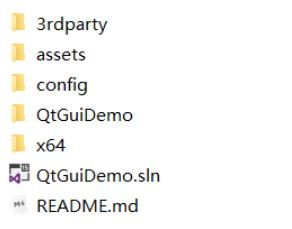
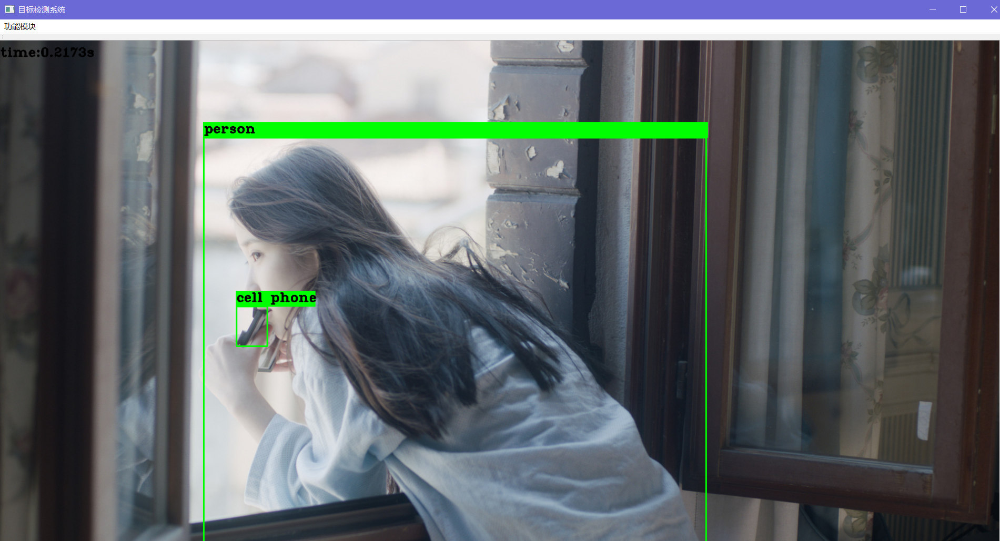
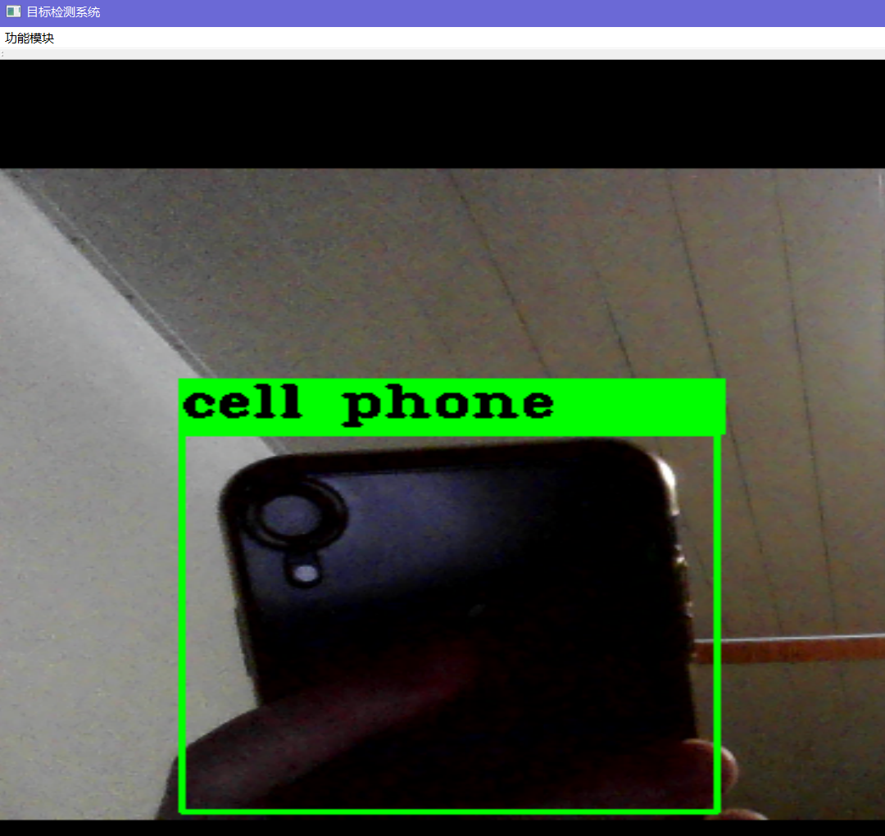

# Yolov4-QtGUI

- Yolov4-QtGUI是基于 [QtGuiDemo](https://github.com/jmu201521121021/QtGuiDemo) 项目开发的可视化目标检测界面，可以简便选择本地图片、摄像头来展示图像处理算法的结果
## 开发软件环境

- **Windows 10**
- **QT 5.9.6**
- **OpenCV 3.4.2**    [download](https://github.com/opencv/opencv/releases/tag/3.4.2)
- **Visual Studio 2017**
- Cuda 10.1 （optional）
- Cudnn >= 7.0 （optional）
## 快速使用demo

下载权重文件：[yolov4_weight](https://pan.baidu.com/s/16js1bfzKFiQ6mJ7NiP_DtA)  提取码：4mic

- CPU Demo：[yolov4_cpu](https://pan.baidu.com/s/1uacNNl6ZL2M3s0GVfkTdVA)    提取码：l3eh     仅需额外安装opencv
- GPU Demo：[yolov4_gpu](https://pan.baidu.com/s/1c-clykwyKHGQp2ENnJjFoA)    提取码：d6lz     除了opencv外还需要安装cuda、cudnn

首先将下载的权重文件放置在  **./model**  目录下

然后双击  **./Release**  目录下的  **QtGuiDemo.exe**  即可

## 使用步骤（项目详解请移步博客：[Yolov4-QtGUI](https://blog.csdn.net/weixin_42448226/article/details/105752224)）

- 下载项目：git clone https://github.com/scutlrr/Yolov4-QtGUI.git
- 将 [3rdparty](https://pan.baidu.com/s/1-60BX9eXrKuUbnqHHyKihw) （提取码：f1vo）放置在项目目录下

- vs打开 **Yolov4-QtGUI\QtGuiDemo.sln** 

- **GPU version**

  -  修改属性文件**yolov4.prop**，"链接器”->"输入"->"附加依赖项"->**yolo_cpp_dll.lib**。在“**x64  release**”模式下，菜单栏点击＂生成＂－>＂生成解决方案＂，并将 

  -        -  3rdparty\libdarknet\bin 路径下的  pthreadGC2.dll、pthreadVC2.dll  
        
           -  3rdparty\libdarknet\bin\release\gpu 路径下的 yolo_cpp_dll.dll
        
           -  3rdparty\libopencv\bin 路径下的  opencv_world342.dll  
        
         复制到Yolov4-QtGUI\x64\release目录下

- **CPU version**
  
  - 修改属性文件**yolov4.prop**，"链接器”->"输入"->"附加依赖项"->**yolo_cpp_dll_cpu.lib**。在＂**x64 release**＂模式下，菜单栏点击＂生成＂－>＂生成解决方案＂，并将 
  
  -        -  3rdparty\libdarknet\bin 路径下的  pthreadGC2.dll、pthreadVC2.dll  
        
           -  3rdparty\libdarknet\bin\release\cpu 路径下的 yolo_cpp_dll.dll
        
           -  3rdparty\libopencv\bin 路径下的  opencv_world342.dll  
        
         复制到Yolov4-QtGUI\x64\release目录下。 

- 运行项目。双击x64\Release目录下的exe文件即可。

## 处理流程

- 将图像处理算法处理之后的图像通过this->InputImage输出到在this->imageLabel控件上
- 本地图片处理：void openPictureSlot()，在这个槽函数处理this->imputImage
- 视频文件和本地摄像头处理：void paintEvent(QPaintEvent *e)，在这个槽函数处理每一帧this->imageLabel

## 结果展示

- 测试图片：

- 测试摄像头：

